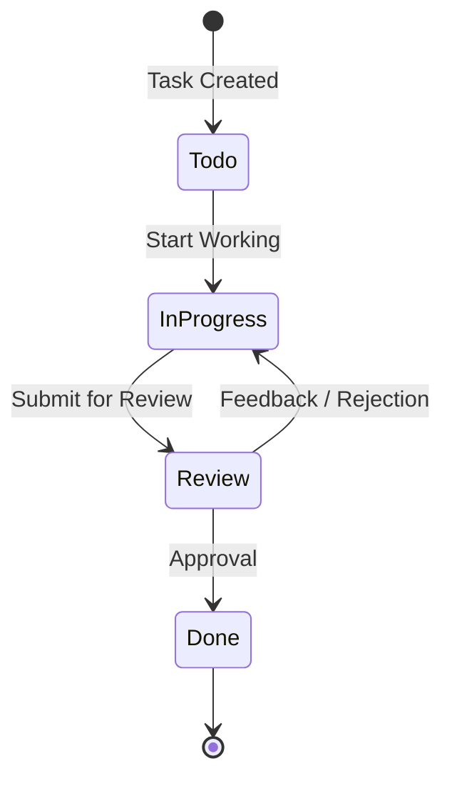

# Business Process Documentation

This section defines the core business logic and workflows implemented in the Task Tracker.

## Task Lifecycle (Workflow)

The following diagram illustrates the standard workflow for a task within the enterprise environment.

## Business Rules

1.  **Ownership**: Only the Project Owner can modify project settings or delete the project.
2.  **Assignment**: Tasks can be assigned to any registered user in the system.
3.  **Audit**: Every task creation and status change is logged for analytics (Future Scope: Audit Logs).
4.  **SLA**: High and Critical priority tasks should have a `DueDate` defined.

## User Roles

| Role | Permissions |
|------|-------------|
| **Project Owner** | Full CRUD on Project, Task management, Assigning users. |
| **Contributor** | View Project, Update assigned Tasks, Change Status. |
| **Stakeholder** | Read-only access to Dashboards and Reports. |
