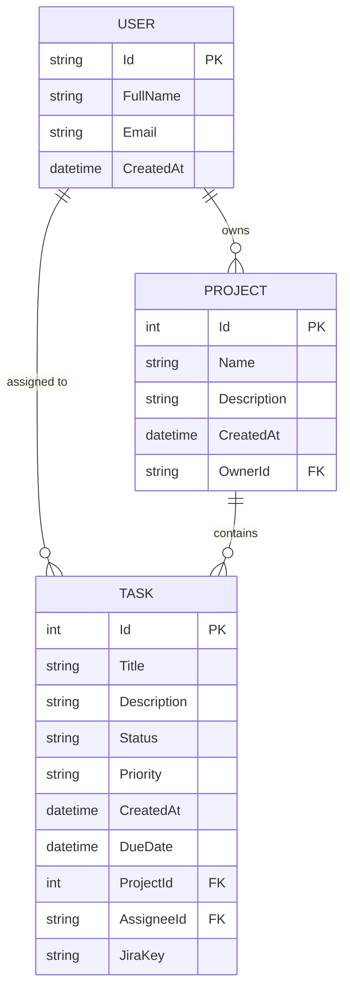

# Database Schema

This document describes the data structure of the Enterprise Task Tracker. The system uses a relational model to manage projects, tasks, and users.

## Entity Relationship Diagram (ERD)

## Data Dictionary

### Users
| Field | Type | Description |
|-------|------|-------------|
| Id | String (UUID) | Unique identifier for the user. |
| FullName | String | Display name of the user. |
| CreatedAt | DateTime | Registration timestamp. |

### Projects
| Field | Type | Description |
|-------|------|-------------|
| Id | Integer | Unique identifier for the project. |
| Name | String(100) | Name of the project. |
| OwnerId | String | Reference to the Project Owner (User). |

### Tasks
| Field | Type | Description |
|-------|------|-------------|
| Id | Integer | Unique identifier for the task. |
| Status | Enum | Todo, InProgress, Review, Done. |
| Priority | Enum | Low, Medium, High, Critical. |
| JiraKey | String | Integration key for Jira synchronization. |
